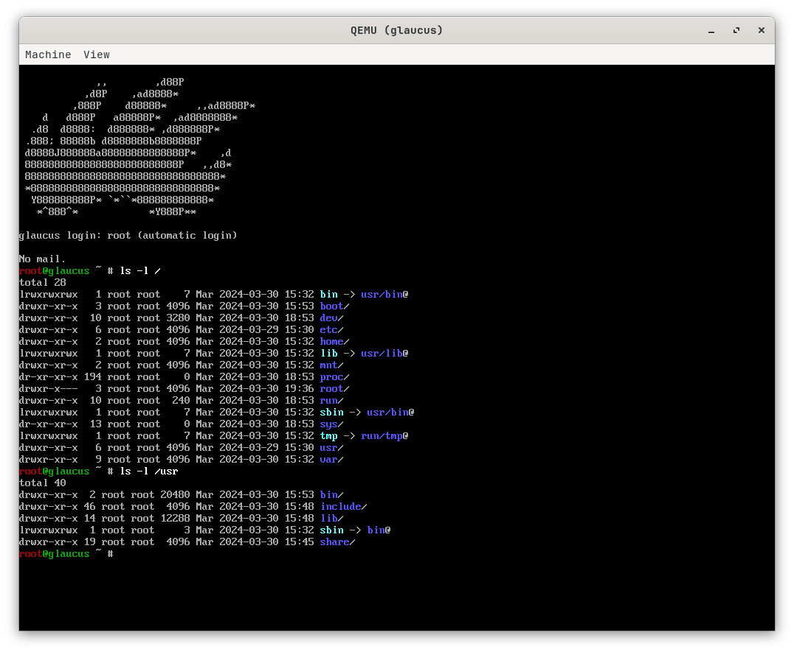

# screenshots
glaucus screenshots

## Simple

## Lightweight

### Filesystem Tree

### s6 Supervision Tree

## Pragmatic
### Command-line Completion and History

### Manual Pages

### Text Editor

### Compiler

### Utilities

## Community
- [Discord](https://discord.gg/nDKNmNc)
- [Reddit](https://reddit.com/r/glaucus)
- [Telegram](https://t.me/glaucuslinux)
- [X](https://x.com/glaucuslinux)
- [YouTube](https://youtube.com/@glaucuslinux)

## Mirrors
- [Codeberg](https://codeberg.org/glaucuslinux/screenshots)
- [GitHub](https://github.com/glaucuslinux/screenshots)
- [SourceHut](https://git.sr.ht/~glaucuslinux/screenshots)
