# screenshots
glaucus's screenshots

## Simple
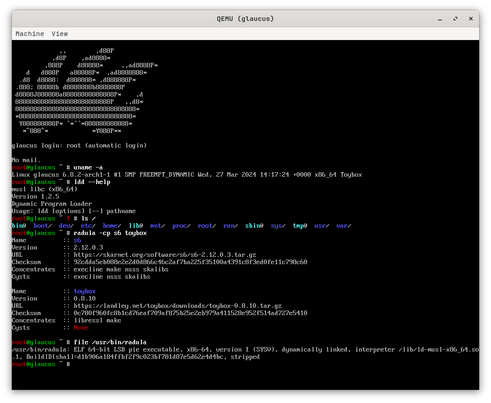

## Lightweight
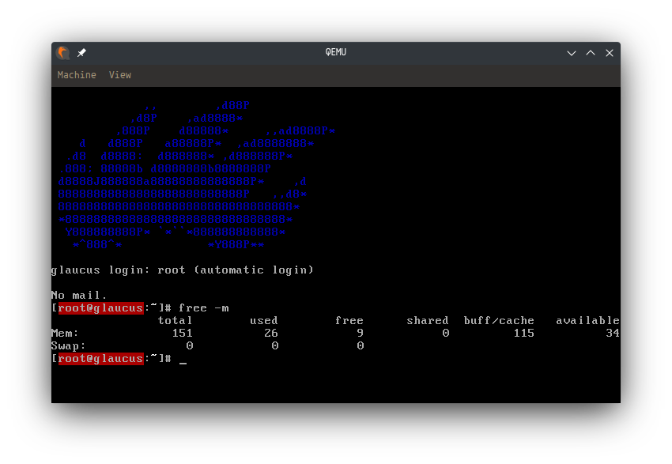

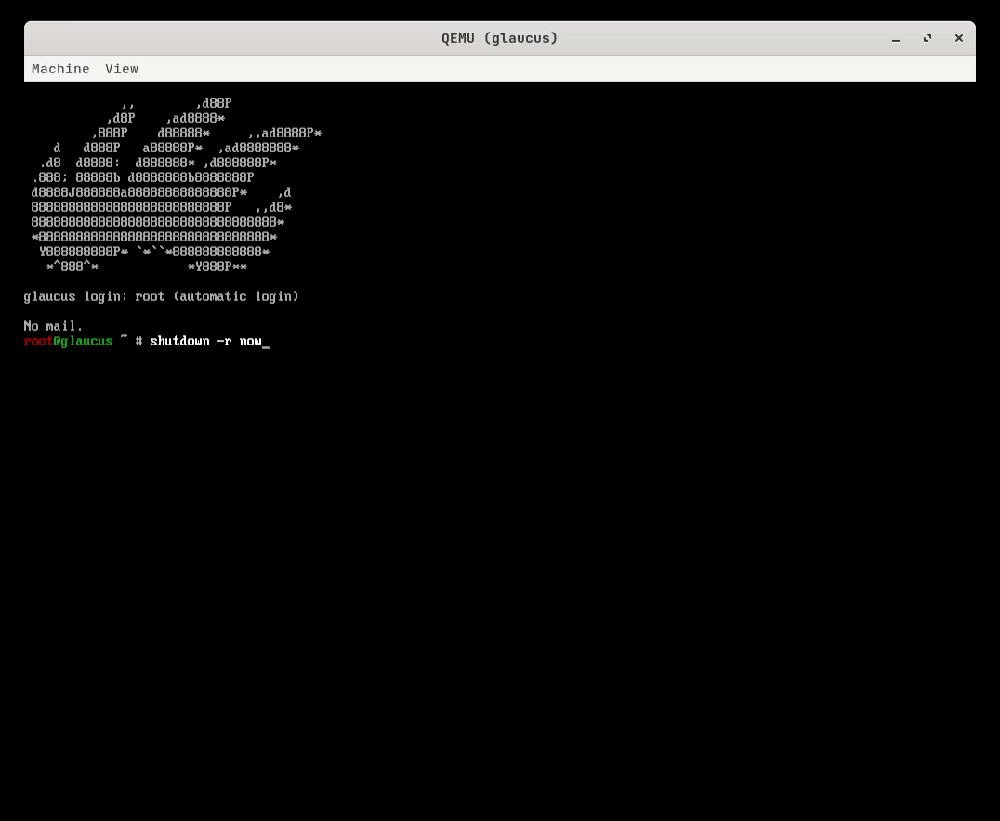

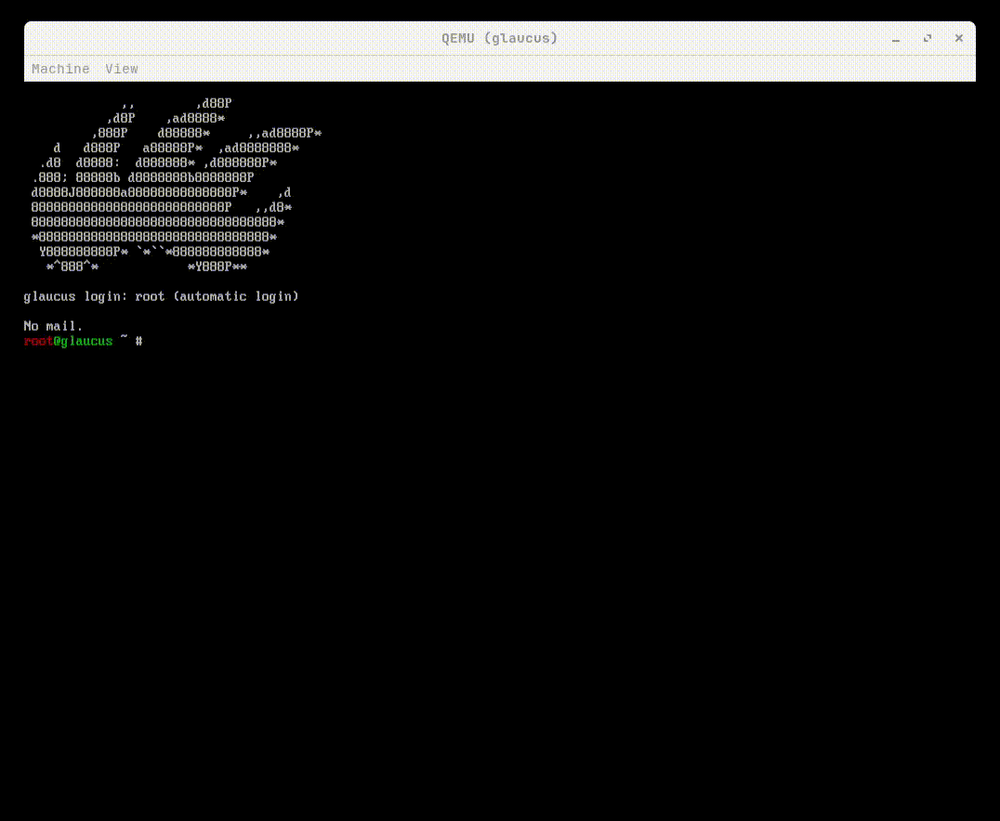

## Clean Filesystem Tree
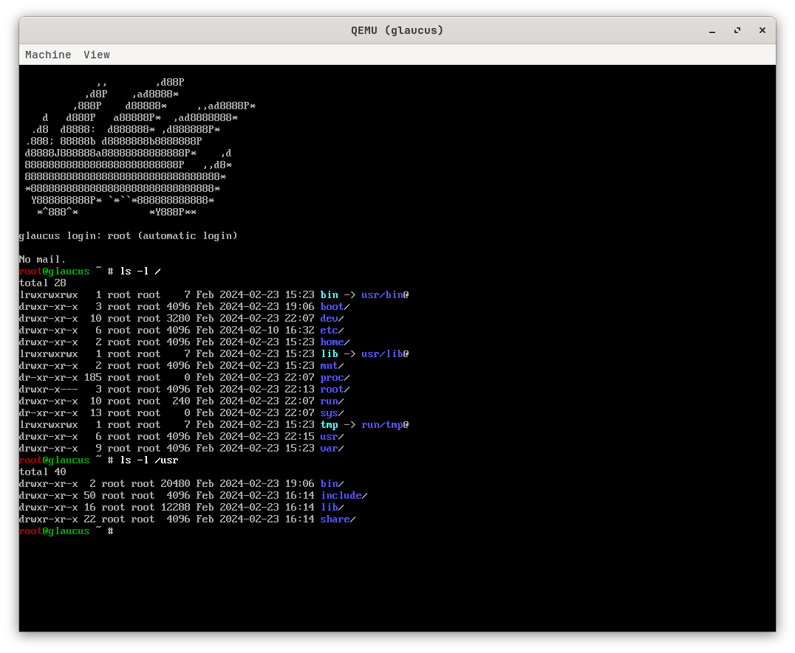

## Clean s6 Supervision Tree
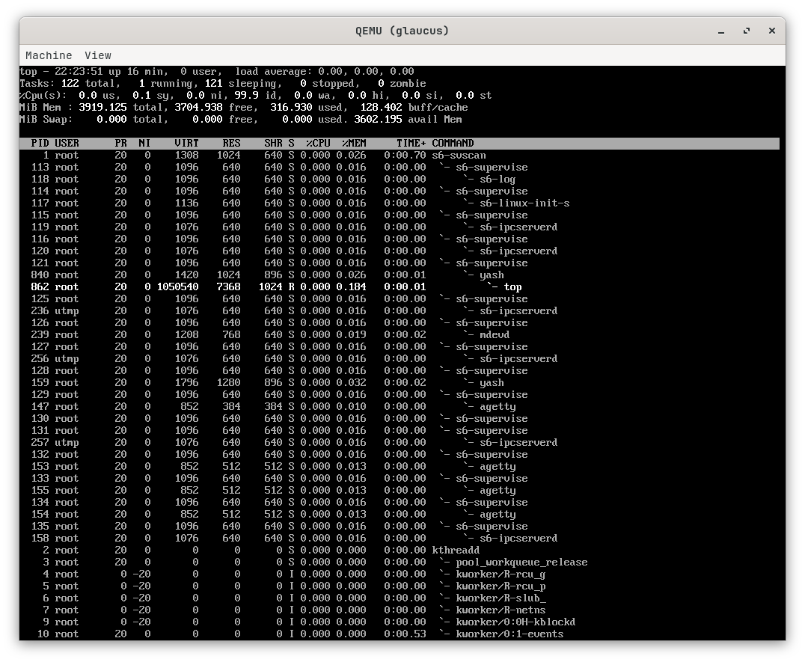

## Convenient
### Command-line Completion and History
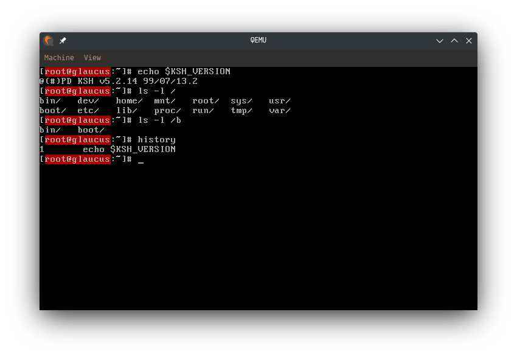

### Manual Pages
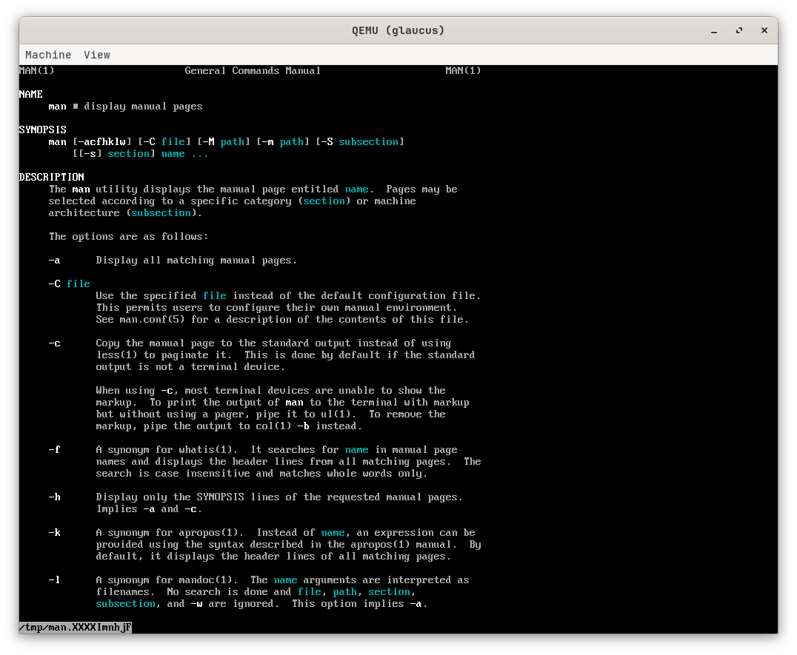

### Modular Text Editor
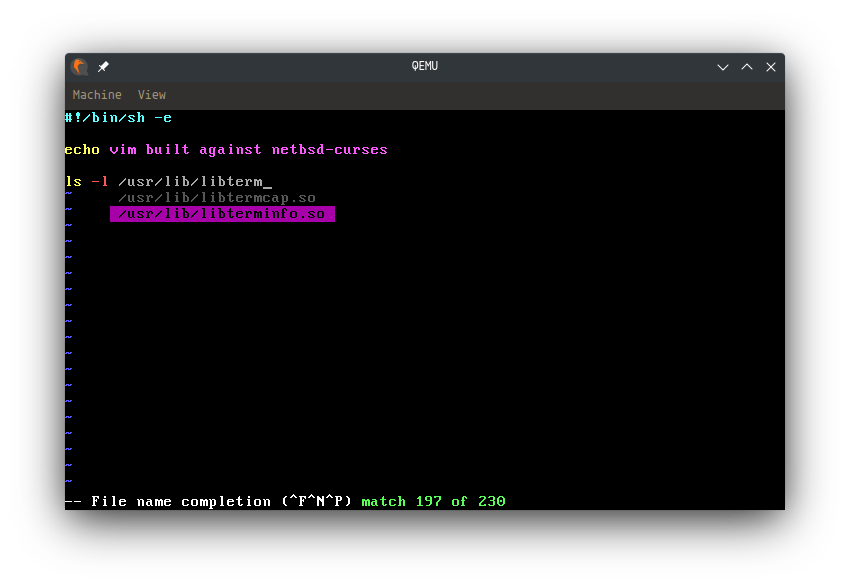

### Powerful Compiler
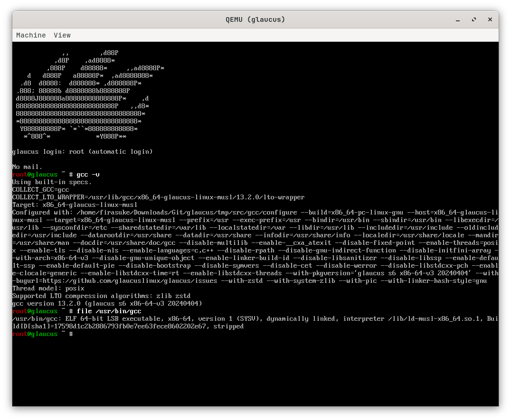

### Next-Gen Utilities

### Modern Kernel
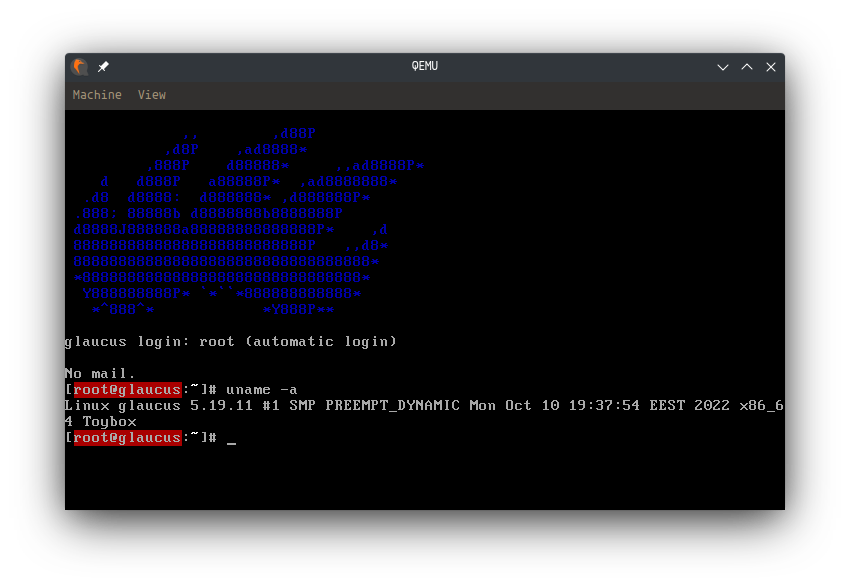

## Community
* [Discord](https://discord.gg/nDKNmNc)
* [Gitter](https://gitter.im/glaucuslinux/screenshots)
* [Reddit](https://www.reddit.com/r/glaucus)
* [Telegram](https://t.me/glaucuslinux)
* [Twitter](https://twitter.com/glaucuslinux)
* [YouTube](https://www.youtube.com/@glaucuslinux)

## Mirrors
* [Codeberg](https://codeberg.org/glaucuslinux/screenshots)
* [Framagit](https://framagit.org/glaucuslinux/screenshots)
* [GitHub](https://github.com/glaucuslinux/screenshots)
* [GitLab](https://gitlab.com/glaucuslinux/screenshots)
* [SourceHut](https://git.sr.ht/~glaucuslinux/screenshots)
