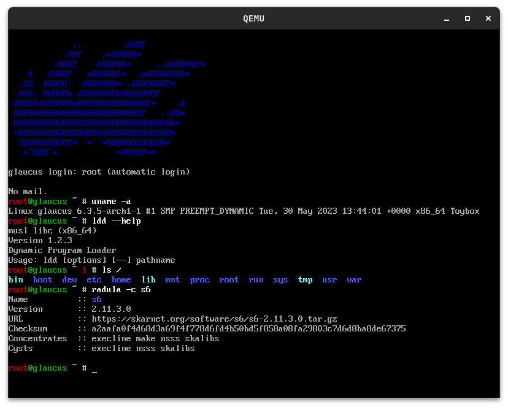

# screenshots

glaucus's screenshots

## Simple

## Lightweight

## Clean Filesystem Tree

## Clean s6 Supervision Tree

## Convenient
### Command-line Completion and History

### Manual Pages

### Modular Text Editor

### Powerful Compiler

### Next-Gen Utilities

### Modern Kernel

## Community
* [Discord](https://discord.gg/nDKNmNc)
* [Gitter](https://gitter.im/glaucuslinux/screenshots)
* [Reddit](https://www.reddit.com/r/glaucus)
* [Telegram](https://t.me/glaucuslinux)
* [Twitter](https://twitter.com/glaucuslinux)
* [YouTube](https://www.youtube.com/@glaucuslinux)

## Mirrors
* [BitBucket](https://bitbucket.org/glaucuslinux/screenshots)
* [Codeberg](https://codeberg.org/glaucuslinux/screenshots)
* [Framagit](https://framagit.org/glaucuslinux/screenshots)
* [GitHub](https://github.com/glaucuslinux/screenshots)
* [GitLab](https://gitlab.com/glaucuslinux/screenshots)
* [NotABug](https://notabug.org/glaucuslinux/screenshots)
* [SourceHut](https://git.sr.ht/~glaucuslinux/screenshots)
